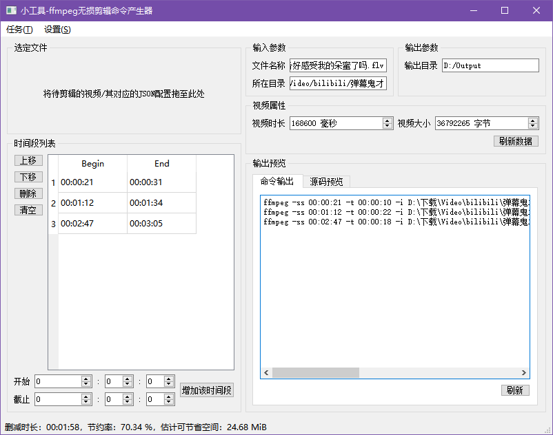

# 小工具：ffmpeg多段无损剪辑命令产生器


一个用来生成ffmpeg命令序列的小工具，可以根据用户需要的时间段，将一个视频切割成多段视频而不会导致画质损失



<br>

## 使用方法
首先系统需安装了Python3与pip，然后执行如下指令：
```shell script
git clone https://github.com/zhangzhilinx/video_cut_cmd_generator.git
cd video_cut_cmd_generator
pip -r requirements.txt
```
上面的步骤成功完成后就可以启动了：
```shell script
python __main__.py
```

<br>

## TODO
* 实现JSON配置文件修改标记
    - 用户进行修改后，提醒用户保存修改后的操作
